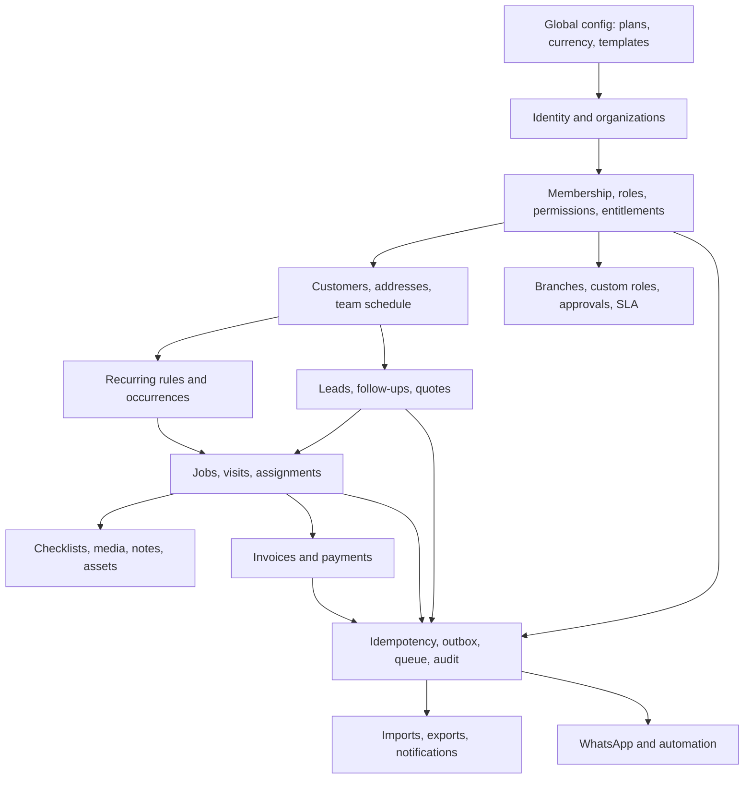

# ARVENA Pre-Build Architecture Audit v1.0

**Audit date:** 7 September 2026  
**Scope:** Pre-build architecture audit only; no application implementation performed  
**Sources of truth reviewed:**

1. ARVENA Master Product Requirements v1.0 (PRD)
2. ARVENA v1.0 - UI/UX Blueprint & Information Architecture (UI/UX)
3. ARVENA v1.0 - Technical Architecture & Data Blueprint (Technical)
4. ARVENA v1.0 - Control, State, Entitlement & Acceptance Specification (Control)
5. Official ARVENA logo/brand asset

## Executive decision

**Overall readiness: 6.4/10**

**Recommendation: CONDITIONAL NO-GO for implementation.**

The product direction is coherent and unusually well defined: ARVENA, Job != Visit, One Input -> Many Outcomes, universal core, organization tenancy, server-authoritative rules, PostgreSQL RLS, exact money, immutable document snapshots, UTC plus explicit timezone, optional WhatsApp, durable/idempotent processing, mobile-first Worker UX, exception-driven Owner UX, and Free export all align across the source set.

However, implementation should not begin against the current documents as a database/API contract. Several contradictions and missing persistence rules would force developers to guess about state, tenant isolation, money integrity, offline replay, recurring generation, plan enforcement, and P0 workflows. Those guesses could create data leaks or irreversible finance/history defects.

This is not a rejection of the product architecture. It is a request for a small **Architecture Correction Pack v1.0.1** before migrations are written. No locked product decision needs to change. One status conflict can be resolved as a documented erratum; any decision to adopt a different behavior than the correction below requires an ADR.

### Readiness by area

| Area | Score | Assessment |
|---|---:|---|
| Product direction and domain boundaries | 9.0 | Strong and consistent |
| UI/UX and information architecture | 7.6 | Clear core flows; several required workflows lack routes/states |
| Data model coverage | 6.0 | Strong core entities; missing operational support entities and tenant-safe relationships |
| Permissions and tenancy | 5.2 | Principles are strong; enforceable scopes and cross-tenant FK safety are underspecified |
| State machines | 6.2 | Baselines exist; quote conflict and configurable-status semantics remain unresolved |
| Finance integrity | 5.5 | Correct philosophy; database invariants, reversal, rounding and race behavior are incomplete |
| Background/event reliability | 5.8 | Correct pattern; queue/outbox claim, retry and dedupe contracts are incomplete |
| Offline Worker flow | 4.8 | UX intent exists; durable server receipt, ordering and conflict behavior do not |
| Plan entitlements | 6.0 | Commercial tiers are clear; effective entitlement and usage enforcement model is incomplete |
| Acceptance coverage | 8.0 | Excellent scenario baseline; expected results need more exactness in security/failure cases |
| Brand implementation readiness | 6.5 | Identity matches PRD; production asset variants are missing |

## 1. Critical blockers

These items should be closed before the first production migration. IDs are stable references for the correction pack and tests.

### C-01 - Tenant ownership can be internally inconsistent

**Evidence:** The locked rule says every tenant-scoped record carries `organization_id` (PRD sections 10-11, 77-79; Technical sections 5 and 48). Most child tables also carry a parent ID, but the blueprint does not require a composite tenant FK. A row could therefore have `organization_id = A` while referencing a `customer_id`, `job_id`, `invoice_id`, `visit_id`, `role_id`, or `member_id` from organization B. RLS on the child row alone would not prevent that corrupted relationship.

**Impact:** Cross-tenant data disclosure through joins, signed media access, reports, or server functions; corruption that is difficult to repair.

**Minimum correction:**

- Give every tenant parent a unique key on `(organization_id, id)`.
- Use composite foreign keys `(organization_id, parent_id) -> parent(organization_id, id)` for every tenant relationship.
- Apply the same rule to polymorphic records through typed link tables or a security-definer validation function that verifies both entity type and tenant. Plain `entity_type + entity_id` is not sufficient.
- Add `organization_id` to tenant join/child tables that omit it, notably `customer_tags`, tenant-owned `checklist_template_items`, and `role_permissions` where the role is organization-owned; otherwise explicitly classify them as global configuration and prevent tenant writes.
- Test malicious cross-tenant inserts and updates, not only reads.

### C-02 - Organization context and scoped authorization are not executable

**Evidence:** A user may belong to multiple organizations because `organization_members` is unique by organization and user, while RLS only says the record's organization must be one the user can access (Technical sections 7, 47-48). The documents do not define how an active organization is selected, how server actions bind it, or how a client-supplied `organization_id` is prevented from becoming a confused-deputy vector. Sales Job scope is not defined; Worker access says assigned Jobs although assignment exists only on Visits; Admin finance scope is “configurable” without a concrete override model (Control sections 2-3).

**Impact:** Overbroad access inside an organization, inconsistent API behavior, and possible tenant mix-ups.

**Minimum correction:** Define one request-context contract: authenticated `user_id`, explicit active `organization_id`, active membership, membership status, effective permissions, branch scope, and assignment scope. Every mutation must derive or validate tenant ownership server-side. Define precise predicates for each role/entity/action in a permission policy catalog. Do not rely on menu visibility.

### C-03 - Quote has two incompatible canonical state vocabularies

**Evidence:** PRD section 23 uses `DRAFT, SENT, ACCEPTED, REJECTED, EXPIRED`. Control section 6, Technical event catalog, and UI/UX section 16 use `ISSUED` and `quote.issued`.

**Impact:** Migration enum/check constraints, event names, UI labels, API payloads and tests cannot all be correct.

**Minimum correction:** Adopt canonical backend state **`ISSUED`** and display label “Sent/Dikirim” where desired. Record this as a v1.0.1 erratum because three later control/technical sources already agree. If the team wants canonical `SENT`, that is a state-contract change and requires an ADR plus updates to all four documents.

### C-04 - Configurable industry statuses conflict with locked state machines

**Evidence:** PRD sections 7, 20, 61, 109-111 say templates/custom businesses can change lead and job statuses/default workflows. Control sections 5-12 lock exact state machines, while Technical section 79 says templates store statuses. The documents do not distinguish canonical lifecycle states from display stages/labels.

**Impact:** Custom statuses can bypass completion, automation, invoice and permission rules, or become cosmetic while the UI promises real workflow customization.

**Minimum correction:** Keep the locked canonical backend state machines. Templates may configure terminology, visible labels, stage ordering, allowed subsets, and mappings to canonical states. Any genuinely new canonical state or transition requires an ADR/PRD version. Store configuration separately from the canonical status columns.

### C-05 - Exact invoice/payment integrity is not yet enforceable

**Evidence:** The documents require exact money, immutable issued snapshots, multi-payment support, transactions, and optimistic concurrency (PRD sections 37-40 and 87; Technical sections 31-33, 49-50, 63). Missing are currency exponent/rounding rules, inclusive/exclusive tax calculation, invariants, overpayment policy, duplicate payment key, reversal/void behavior, and row-lock order. `paid_minor` and `outstanding_minor` are stored alongside payments without a declared source of truth. Control allows privileged `ISSUED -> VOID`, but does not define whether an invoice with payments can be voided.

**Impact:** Incorrect balances, double payments, silent historical mutation, and race conditions.

**Minimum correction:**

- Define document currency and currency exponent at document creation; use integer minor units and one deterministic rounding algorithm per line/tax/document.
- Make payment ledger rows the financial source of truth; invoice balance columns are transactionally maintained projections with checks: totals nonnegative, `paid_minor >= 0`, and `outstanding_minor = total_minor - net_settled_payments` subject to an explicit overpayment policy.
- Lock the invoice row when recording/reversing a payment; require an idempotency key unique within the organization/provider.
- Never update or delete a settled payment in place. Add reversal/adjustment records or status transitions with append-only history.
- Prohibit void when net settled payment is non-zero unless a privileged reversal/refund workflow has first resolved it.
- Enforce issued quote/invoice snapshot immutability at the database/service boundary, not only in the UI.

### C-06 - Offline replay has no durable server contract

**Evidence:** PRD sections 31-33 and tests 122; UI/UX sections 26-27; Technical section 61 specify a local queue with `client_action_id`, but no server receipt/idempotency entity exists. Ordering, stale versions, dependent actions, device identity, clock trust, photo retry linkage and conflict behavior are undefined.

**Impact:** Duplicate or out-of-order status transitions, lost checklists/notes/photos, and a false “synced” state.

**Minimum correction:** Add a durable `client_action_receipts`/`idempotency_keys` table scoped by organization and actor, unique on `(organization_id, actor_id, client_action_id)`. Accept a batch with client sequence, action type, entity, expected version, local occurrence time and payload version. Process each action transactionally in sequence; return per-action `APPLIED`, `DUPLICATE`, `CONFLICT`, `REJECTED`, or `RETRYABLE`. Server timestamps remain authoritative while retaining device timestamps as evidence. Media retries reuse one logical media ID. Define the completion rule when required photos are still locally pending.

### C-07 - Durable queue/outbox processing is only conceptual

**Evidence:** PRD sections 47-51 and Technical sections 51-58 require durable queues, retries, dead letters and outbox. The proposed `event_outbox` lacks attempt count, next attempt, claim/lease data, error data, payload version and dedupe key. The domain list mentions queue jobs but no queue entity/contract exists. `automation_runs.trigger_event_id` is ambiguous.

**Impact:** Double execution, stuck records, unsafe concurrent workers, no deterministic recovery, and weak observability.

**Minimum correction:** Define an outbox/queue contract with unique event ID, payload version, status, available/next-attempt time, attempt count, lease owner/time, last error, published/completed time and optional dedupe key. Claim using transactional `FOR UPDATE SKIP LOCKED` or the chosen queue's equivalent. Consumers must have their own idempotency constraint; an “at least once” queue alone is not enough. Define exactly what `trigger_event_id` references.

### C-08 - Recurring generation is race-prone and tier semantics are undefined

**Evidence:** `recurring_occurrences` has a useful unique `(recurring_rule_id, occurrence_at)`, but rule claiming, horizon, timezone/DST resolution, `next_occurrence_at` updates, retries and generated Job transaction are not defined (PRD sections 36, 49, 124; Technical sections 34-35). “Basic”, “advanced” and “recurring contracts” lack capability boundaries across tiers.

**Impact:** Duplicate/missed Jobs, DST shifts, retroactive rule effects and inconsistent plan gating.

**Minimum correction:** Persist versioned rule snapshots on occurrences; generate only a configured near-term horizon; atomically insert occurrence, Job/Visit and outbox event; use `ON CONFLICT DO NOTHING` plus locked rule advancement; define DST gap/overlap behavior and cancellation/skip semantics. Add an entitlement capability table that precisely differentiates basic scheduling, automated generation/reminders, and contract/SLA behavior.

### C-09 - Several P0 commitments have no complete persistence + UI + backend chain

The build rule requires all four, but the following chains are incomplete:

| P0 commitment | Missing or ambiguous pieces |
|---|---|
| Team onboarding/management | No user profile, invitation, member skill, or invitation lifecycle entity; Team UI promises skills |
| Industry templates/modules | `industry_template_id` exists but no canonical template/module/version/organization-module schema |
| Tax/settings | Quote/invoice taxes and Settings > Tax exist, but no tax configuration entity or calculation/version snapshot contract |
| Import | No import job, row error, mapping, commit summary, rollback/trace entity; no route in UI/UX |
| Export | No export job/file authorization/expiry model and no explicit UI entry; Free access is locked |
| Basic recurring | No recurring list/create/edit/detail UI or navigation entry |
| Service settings | Organization business address and localization settings do not have a complete model |
| Notification preferences | PRD promises configurable preferences; only notification delivery records exist |
| Entitlement override | Control requires organization-specific overrides; no override/subscription/current-period entity exists |

**Impact:** Developers would either omit P0 functionality or invent incompatible schemas and workflows.

**Minimum correction:** Add only the support entities/routes required by the approved features; see the database dependency map and implementation order below.

### C-10 - WhatsApp inbound cannot safely resolve a tenant/connection

**Evidence:** The inbound flow says normalize sender and find customer “in organization,” but `external_events.organization_id` is nullable and there is no required `integration_id`/external account key on the event (PRD sections 43-46; Technical sections 38-39, 58-59). Uniqueness is only `(provider, external_event_id)`. Consent/opt-in state for outbound messaging is also not modeled.

**Impact:** Events can be attributed to the wrong tenant, dedupe across two connected accounts incorrectly, or send non-compliant outbound messages.

**Minimum correction:** Resolve the receiving external account/phone to one active `integration_id` before business processing. Scope dedupe by provider plus stable provider account/connection plus event ID. Store signature verification result, raw payload hash, received time and processing result. Add minimal customer communication-consent/preference fields or records before outbound automation. Retain WhatsApp as optional and isolate provider failures.

## 2. High-risk inconsistencies

| ID | Finding | Evidence / risk | Minimum correction |
|---|---|---|---|
| H-01 | Branch filtering cannot be represented consistently | UI invoice filters include branch; P2 branch scope includes customers “where applicable”; `invoices` and `customers` lack branch relation | Add `job.branch_id` as operational source; add nullable `invoice.branch_id` snapshot for invoices without/with Jobs as decided; add `customer_branches` only if customers may belong to multiple branches. Decide before P2, but keep P0 schema extensible. |
| H-02 | Sales and Worker scopes are incomplete | Sales Jobs/Visits scope is not defined; Worker “assigned Jobs” is derived only through Visit assignment | Publish entity/action predicates. Worker can read a Job only when an active assignment exists on one of its Visits, with fields minimized. Sales Job access must be explicitly owner/creator/assigned/shared pool or denied. |
| H-03 | Configurable Admin finance permissions have no model | System roles may be global while organizations need different Admin grants | Instantiate organization-owned role profiles copied from base system templates, or add explicit member permission overrides. Choose one; do not mix implicit exceptions. |
| H-04 | Polymorphic Notes and Activities have weak referential security | `entity_type + entity_id` has no FK and can reference another tenant | Prefer typed link columns/check constraints for supported P0 entities, or enforce tenant existence through a trusted database function on insert/update. RLS must check the referenced entity scope for Workers/Sales. |
| H-05 | Media authorization is underspecified | Storage key contains tenant ID but a path is not authorization; media can reference several parents inconsistently | Require one valid parent scope, composite tenant FKs, private bucket, short-lived signed access issued after entity-level authorization, MIME/content checks, quota reservation and cleanup of abandoned uploads. |
| H-06 | Quote acceptance and conversion can duplicate Jobs | Transaction required, but no unique conversion/idempotency rule | Define whether a quote creates one Job in v1. If yes, unique non-null `(organization_id, quote_id)` on Jobs or a conversion ledger. If multiple are allowed, require an explicit split workflow—not accidental retries. |
| H-07 | Lead/Quote/Job state coupling is undefined | UI says “Quote accepted -> Convert to Job”; lead state contains QUOTE/NEGOTIATION/WON, but no automatic transition rule | Specify events: quote issued may move Qualified -> Quote; accepted quote does not silently mark Won until conversion/explicit win; conversion idempotently links Lead, Quote and Job and writes history/activity/outbox. |
| H-08 | Job scheduling duplicates Visit scheduling | Jobs have `scheduled_start/end`; Visits are the actual schedule and multi-visit is locked | Declare Visit as schedule source of truth. Treat Job dates as derived/cache/window fields with documented recomputation, or remove them from writes. “Next Visit” must be a query/derived field. |
| H-09 | Job completion with pending offline evidence is ambiguous | Control allows photos “uploaded/safely pending according to business rule,” while UI must not pretend uploads succeeded | For P0, Visit may enter `COMPLETION_PENDING_SYNC` as a sync presentation state without changing canonical state, or Finish remains queued until required uploads and checklist are accepted server-side. Select one exact rule before build. |
| H-10 | Privileged reopen is not a state transition contract | Completed/Cancelled Job may be reopened but target state, permissions, reason and downstream effects are absent | Define exact target, required permission/reason, version check, audit/activity, and behavior if invoice/recurring/automation already exists. Prefer no reopen in P0 unless necessary. |
| H-11 | Schedule conflict override is not durable | PRD requires actor/time/reason; no conflict override entity/fields | Add `schedule_override` record or visit-level override metadata with detected conflict IDs, actor, timestamp and reason. Enforce overlap check inside the scheduling transaction. |
| H-12 | Usage enforcement can race | `usage_counters` is a mutable number with no atomic reservation/ledger rule | Use an append-only usage ledger or atomic counter UPSERT plus reservation for storage/messages. Define billing period in organization timezone and idempotency source. |
| H-13 | Entitlement source of truth is duplicated | `organizations.subscription_plan` plus config-backed entitlements, no subscription lifecycle or override precedence | Define effective entitlement resolution: plan version -> subscription period/status -> organization override -> usage. Cache only the result; backend authoritative. |
| H-14 | Soft delete uniqueness is unspecified | Archived phone/service/member rows can continue blocking creation or be reused unexpectedly | Define partial unique indexes and restore behavior per entity. Historical foreign keys must remain valid. |
| H-15 | Number generation lacks sequence entity | Transactional organization sequence is required but not modeled | Add `document_sequences(organization_id, document_type, period_key, next_value)` and lock/update atomically. Numbers are presentation identifiers, never authorization. |
| H-16 | External event retention/privacy is undefined | Payload handling is described but raw payload storage, PII retention and redaction are not | Store minimal envelope and encrypted/restricted raw payload only as needed; define retention and redact logs. |
| H-17 | Invoice/Quote edit routes can violate immutability | UI exposes `/quotes/[id]/edit` and `/invoices/[id]/edit` without state qualification | Permit edits only in DRAFT. For issued records route to view/revise/void flows based on permission; never silently mutate snapshots. |
| H-18 | Owner removal safety needs transaction-level enforcement | “At least one active Owner” is specified, but concurrent removals can both pass a count check | Serialize owner role/disable changes per organization and enforce through one server/database function with row/advisory lock. |

## 3. Medium and low issues

### Medium

| ID | Issue | Correction |
|---|---|---|
| M-01 | `assigned_sales_id`, `assigned_to`, `received_by`, `completed_by`, and `uploaded_by` do not say whether they reference auth users or organization members | Reference `organization_members.id` using composite tenant FKs so organization role/status is enforceable. Keep auth user identity separate. |
| M-02 | `updated_at`, actor columns and `version` are inconsistent across mutable tables | Adopt common columns by category and database-managed timestamps/versioning. |
| M-03 | Customer duplicate override is promised by UI but uniqueness is only “suggested” | Define `duplicate_override_reason`, actor/audit event, and either allow multiple rows via a canonical phone identity/link table or provide an explicit authorized exception path. Do not combine a hard unique index with “Create Anyway.” |
| M-04 | International phone normalization rules are too narrow | Use E.164 where possible with country context, preserve raw input, handle extensions/non-mobile numbers, and make WhatsApp capability separate from general phone validity. |
| M-05 | Global address flexibility is promised but only one fixed shape is defined | Keep canonical fields plus `formatted_address` and optional region-specific metadata; validate country code, coordinate ranges, and geocoding provenance. |
| M-06 | User timezone is mentioned but not modeled | Add user/member timezone preference with organization fallback and visit/recurrence explicit timezone. |
| M-07 | DST behavior is absent | Define nonexistent local times, repeated local times, and timezone changes for visits and recurrence. |
| M-08 | Dashboard exception definitions are not exact | Define query semantics for late, overdue, unassigned, inactive and recurrence-due, including timezone, archived/cancelled exclusions and branch scope. |
| M-09 | Notification delivery state is missing | Add channel, status, attempts, scheduled/sent/failed timestamps and provider reference; separate in-app notification from outbound delivery. |
| M-10 | Follow-up snooze history is too thin | Current `snoozed_from` records only one value. Add append-only activity/history so repeated snoozes are auditable. |
| M-11 | Availability does not cover effective dates or exceptions | Add validity period or versioning; leave remains the exception layer. Clarify overnight shifts. |
| M-12 | Calendar drag/reschedule “after confirmation” is ambiguous | Define confirmation UX, version check, overlap transaction and notification/outbox event. |
| M-13 | Search requirements include permission-sensitive fields but search policy is generic | Search views/functions must apply the same RLS/scope predicates as entity reads; do not use a privileged unfiltered search index. |
| M-14 | Report definitions may drift | Version metric definitions and require drill-through filters to use the same predicates. |
| M-15 | Export scope is “basic” but exact datasets/fields are not fixed | For Free P0, define customers, Jobs, invoices and payments; redact secrets/internal-only fields; include timezone/currency metadata. |
| M-16 | Import accepts CSV/Excel but UI route and atomicity strategy are absent | Add import center route, staged rows, validation report, explicit commit, idempotent re-run and downloadable errors. |
| M-17 | Deletion/privacy workflow may conflict with immutable finance/audit | Define pseudonymization vs legal retention and which records can be erased, archived or retained. Legal review remains separate. |
| M-18 | Backup targets do not define restore verification evidence | Record restore drills, object-storage reconciliation, encryption and ownership. |
| M-19 | P0 includes asset photos but Media does not define checksum | Add content checksum to dedupe/retry safely and verify upload finalization. |
| M-20 | Product analytics entity/consent path is not described | Keep product analytics separate from tenant operational activity, minimize PII and define opt-out/retention. |

### Low / polish

| ID | Issue | Correction |
|---|---|---|
| L-01 | IA says “Billing & Usage” while routes expose `/settings/billing` | Choose one canonical route and redirect alias. |
| L-02 | Payment can be created from `/payments/new` and Invoice detail | Make Invoice detail the primary path; standalone entry must require invoice selection and same permission rules. |
| L-03 | Some UI action labels mix Job and Visit actions | Make `Start/Depart/Arrive/Finish Work` Visit actions; Job CTA orchestrates/surfaces the next Visit. |
| L-04 | No explicit 403/permission-denied UX is described beyond quality gates | Add a standard permission-denied page/inline state without exposing record existence across tenants. |
| L-05 | Retry UI does not say when retry is unsafe | Server-generated idempotency key must persist with retained form state across retries. |
| L-06 | Logo is a 1254x1254 sRGB raster with white background and no alpha/vector variants | Produce approved SVG, transparent PNG, icon-only mark, monochrome/light-dark variants, safe-area/minimum-size rules and favicon/app icon exports. Preserve the approved botanical A/root/growth construction and colors. |
| L-07 | Raster logo contains tonal texture/variation, so UI colors should not be sampled casually | Use the locked token values `#073525`, `#698D70`, `#98ACA4`, `#FDFDFB`; treat the logo artwork as a brand asset, not a color source. |

## 4. Missing decisions

The following must be decided before the affected dependency is implemented. Recommended defaults are deliberately conservative and preserve the approved direction.

| Decision ID | Required decision | Recommended default | ADR required? |
|---|---|---|---|
| D-01 | Canonical Quote state: SENT or ISSUED | `ISSUED`; “Sent/Dikirim” is a UI label | Erratum if accepted; ADR if choosing otherwise |
| D-02 | Meaning of configurable statuses | Canonical states locked; templates configure labels, subsets and mappings | No, if documented as clarification |
| D-03 | Active organization request context | Explicit active org validated against active membership on every request | No |
| D-04 | Organization membership cardinality | User may join multiple organizations; plan “1 organization” means organizations owned/created under the Free commercial account, not membership count | No, but commercial wording must be fixed |
| D-05 | Organization-specific role customization below Ultra | Base role profile per organization; only Ultra can create arbitrary roles; explicit Admin grants still configurable | No |
| D-06 | Customer duplicate override | Authorized override with reason and audit, while retaining a canonical-phone duplicate warning | No |
| D-07 | Source of truth for Job dates | Visits are authoritative; Job date window/next visit is derived | No; aligns with Job != Visit |
| D-08 | Quote-to-Job cardinality | One Quote -> at most one Job in v1 | No; if allowing multiple, document workflow |
| D-09 | Lead status after Quote issue/accept/Job conversion | Issue moves to QUOTE; acceptance permits conversion; conversion marks WON | No |
| D-10 | Required-photo behavior offline | Finish remains locally pending and Visit is completed server-side only after required evidence/checklist sync succeeds | No |
| D-11 | Job reopen | Disable in P0; add privileged controlled transition later with reason and downstream checks | No; enabling arbitrary reopen would need specification update |
| D-12 | Overpayment | Reject by default; privileged credit/refund design later | No |
| D-13 | Payment correction | Append-only reversal, never in-place edit/delete | No |
| D-14 | Money rounding and tax | Currency exponent registry; round per line then aggregate; tax behavior snapshotted | No |
| D-15 | Recurrence horizon | Rolling 60 days, configurable globally; idempotent daily generator | No |
| D-16 | DST gap/overlap | Shift nonexistent time forward to next valid local time; choose earlier offset for ambiguous time, record resolution metadata | No |
| D-17 | Free import scope | Customers and basic assets; catalog import becomes useful only when Catalog entitlement is active | No |
| D-18 | Free export scope | Customers, Jobs, invoices and payments; always available to Owner | Locked direction; no ADR to implement |
| D-19 | P0 tax complexity | One tax profile per organization plus line tax behavior; multiple jurisdictions/rates later | No |
| D-20 | Branch ownership of customers/invoices | Customer organization-wide by default; Jobs branch-owned; invoice snapshots branch from Job or explicit branch | Decide before P2 |
| D-21 | External event uniqueness | Provider + integration/external account + external event ID | No |
| D-22 | Data retention for raw webhooks/media/exports | Minimal documented defaults with configurable future policy; exports expire | No |
| D-23 | Basic vs advanced recurring | Free: manual rule + idempotent near-term Job generation; Pro: reminders/templates/advanced patterns; Ultra: contracts/SLA | No |
| D-24 | Basic vs full audit | Critical security/finance events always retained; Ultra unlocks complete searchable user-visible audit | No |

## 5. Recommended correction pack

Complete these artifacts before implementation starts:

1. **State Contract v1.0.1** - canonical states, transitions, guards, role permissions, side effects and idempotency for Lead, Quote, Job, Visit, Invoice, Payment, Follow-up, Media, Automation and recurring occurrence.
2. **Tenant & Permission Policy Catalog** - active organization resolution and one ALLOW/DENY predicate for every entity/action/role, including branch and assignment scope.
3. **Database Schema Addendum** - composite tenant FKs, support entities listed below, unique/check constraints, delete/archive behavior and immutable-record guards.
4. **Money & Document Calculation Contract** - currency exponent, rounding, tax, snapshot schema, payment/reversal and lock order.
5. **Background Processing Contract** - outbox schema, queue claim/lease, retry schedule, dead letter, consumer idempotency and observability.
6. **Offline Sync Protocol** - action envelope, ordering, expected version, receipt statuses, photo lifecycle and conflict UX.
7. **Entitlement Catalog** - exact feature keys/limits for Free/Pro/Ultra, override precedence, usage period and 80%/100% behavior.
8. **Workflow IA Addendum** - routes/actions/states for import, export, recurring, service catalog, automation, notification preferences and audit where entitled.
9. **Acceptance Fixtures** - seeded Organization A/B, every base role, branch/assignment scenarios, currency/timezone fixtures and duplicate/retry fixtures.
10. **Brand Asset Pack** - production vector/raster variants without changing the approved identity.

## 6. Final database dependency map

This map is the smallest complete persistence boundary implied by the approved product. Names are recommendations; behavior is the contract.

### 6.1 Global/configuration layer

| Entity | Depends on | Purpose / key constraints | Phase |
|---|---|---|---|
| `currency_definitions` | - | ISO code, exponent, formatting metadata; read-only config | P0 |
| `plans` | - | FREE/PRO/ULTRA and version | P0 |
| `plan_entitlements` | `plans` | Unique `(plan_version, feature_key)` | P0 |
| `industry_templates` | - | Stable template identity and version | P0 |
| `industry_template_versions` | `industry_templates` | Immutable terminology/workflow/module defaults | P0 |
| `system_role_templates` | - | OWNER/ADMIN/SALES/WORKER/SUPERVISOR/FINANCE defaults | P0 |

### 6.2 Identity, tenant and commercial control

| Entity | Depends on | Purpose / key constraints | Phase |
|---|---|---|---|
| `user_profiles` | auth user | Name, phone, locale/timezone preference; no tenant role | P0 |
| `organizations` | template version, currency | Country, currency, timezone, locale, status | P0 |
| `organization_settings` | organization | Business address, numbering, basic tax/localization/workflow config | P0 |
| `organization_modules` | organization, template/module config | Enabled optional modules; unique org/module | P0 |
| `organization_invitations` | organization, inviter, role | Token hash, expiry, status; one active invite/email/org | P0 |
| `organization_members` | organization, auth user, role | Unique org/user; status; branch later | P0 |
| `roles` | organization nullable/system template | Org-owned effective roles; custom creation gated | P0/P2 |
| `role_permissions` | role | Explicit permission keys; tenant-safe ownership | P0 |
| `member_permission_overrides` (only if chosen) | member | Explicit configurable grants/denies; avoid if org-owned roles suffice | P0 |
| `member_skills` | member, organization | Skills shown in Team UI/assignment | P0 |
| `member_availability` | member | Timezone/effective dates; non-overlap checks | P0 |
| `member_leave` | member | Approved/unavailable time ranges | P0 |
| `subscriptions` | organization, plan | Status, plan version, period, renewal metadata | P0 |
| `organization_entitlement_overrides` | organization | Dated feature/limit override with reason/actor | P0 |
| `usage_ledger` / atomic `usage_counters` | organization, subscription period | Idempotent usage source and aggregate | P0; expanded P1 |
| `branches` | organization | P2 branch identity/timezone/address | P2 |

### 6.3 CRM and sales

| Entity | Depends on | Purpose / key constraints | Phase |
|---|---|---|---|
| `customers` | organization, assigned member | Canonical/raw phones, type/status, archive/version | P0 |
| `customer_addresses` | customer | Composite tenant FK; primary-address uniqueness | P0 |
| `tags` | organization | Unique active normalized name | P0 |
| `customer_tags` | organization, customer, tag | Composite tenant FKs; unique pair | P0 |
| `customer_contact_preferences` | customer | Channel consent/opt-in/source/timestamp | P0 manual; required P1 outbound |
| `service_catalog` | organization | Pro management entitlement; snapshots consumed by documents | P1 (schema may exist P0) |
| `leads` | customer, assigned member, optional service | Canonical state, version, money/currency | P0 |
| `lead_status_history` | lead, member | Append-only; transition recorded transactionally | P0 |
| `follow_ups` | customer + optional one context entity | Due/status/assignee/version | P0 |
| `follow_up_history` or `activities` | follow-up | Repeated snooze/completion evidence | P0 |
| `quotes` | customer, lead | Canonical state, immutable issued snapshot, version | P0 |
| `quote_items` | quote, optional service | Snapshot values; immutable after issue | P0 |

### 6.4 Work, scheduling and evidence

| Entity | Depends on | Purpose / key constraints | Phase |
|---|---|---|---|
| `document_sequences` | organization | Transactional Job/Quote/Invoice numbers | P0 |
| `jobs` | customer, optional lead/quote/address/branch | Central work aggregate, state/version; conversion idempotency | P0 |
| `job_items` | job, optional service | Snapshot/custom services | P0 |
| `visits` | job | Authoritative schedule, timezone, canonical state/version | P0 |
| `visit_assignments` | visit, member | Unique active assignment; composite tenant FKs | P0 |
| `schedule_conflict_overrides` | visit, conflicting visit, actor | Explicit override evidence | P0 |
| `checklist_templates` | organization/template version | Global or tenant ownership made explicit | P0 |
| `checklist_template_items` | checklist template | Stable item keys/version | P0 |
| `job_checklists` | job, optional visit | Immutable template snapshot | P0 |
| `checklist_responses` | job checklist, member | Idempotent item response/version | P0 |
| `media` | organization and exactly one/more authorized parent links | Logical media state, checksum, storage key, quota reservation | P0 |
| `notes` | typed entity relation, member | Tenant and scope-checked internal notes | P0 |
| `assets` | customer | Basic asset history | P0 |
| `job_assets` | job, asset | Tenant-safe unique pair | P0 |

### 6.5 Billing

| Entity | Depends on | Purpose / key constraints | Phase |
|---|---|---|---|
| `tax_profiles` | organization | P0 simple effective tax settings/version | P0 |
| `invoices` | customer, optional job/quote/branch | Draft mutable; issued snapshot immutable; locked balance/version | P0 |
| `invoice_items` | invoice | Exact snapshot and deterministic totals | P0 |
| `payments` | invoice, member | Append-only ledger entry, external/idempotency key | P0 |
| `payment_reversals` | payment, member | Append-only correction | P0 |
| `document_state_history` or typed histories | quote/invoice/job | Actor/reason/transition evidence for critical documents | P0 |

### 6.6 Recurring, events, reliability and platform operations

| Entity | Depends on | Purpose / key constraints | Phase |
|---|---|---|---|
| `recurring_rules` | customer, optional service/asset | Explicit timezone, versioned future template | P0 basic |
| `recurring_occurrences` | rule, generated Job | Unique rule/local occurrence; rule snapshot/status/attempt | P0 basic |
| `activities` | organization + validated entity | Append-only operational timeline | P0 |
| `audit_logs` | organization + actor/entity | Critical always; full searchable UI Ultra | P0 storage/P2 UI |
| `idempotency_keys` / `client_action_receipts` | organization, actor | Double-submit/offline/API result receipt with expiry | P0 |
| `event_outbox` | organization + originating transaction | Durable event envelope/claim/retry/dedupe | P0 foundation |
| `queue_jobs` or managed durable queue metadata | outbox/run/import/export | Claim/lease/retry/dead-letter | P0 foundation |
| `notifications` | recipient/entity | In-app record | P0 |
| `notification_deliveries` | notification | Channel state/provider retry | P0/P1 |
| `notification_preferences` | member | Channel preferences | P0 |
| `import_jobs` | organization, actor, media | Mapping, status, counts, idempotency | P0 |
| `import_rows` | import job | Staged normalized data/errors/duplicate resolution | P0 |
| `export_jobs` | organization, actor | Dataset/filter/status/expiry/private media result | P0 |
| `integrations` | organization | Provider account, secret reference, health | P1 |
| `external_events` | integration | Verified envelope, account-scoped dedupe, processing state | P1 |
| `automation_rules` | organization | Template/advanced entitlement, version | P1/P2 |
| `automation_runs` | rule, exact trigger event | Unique trigger/action identity, state/retry | P1/P2 |
| `custom_field_definitions/values` | organization/entity | Pro metadata-driven fields with scope validation | P1 |
| `approval_requests/decisions` | organization/entity/members | Ultra approval lifecycle | P2 |
| `sla_contracts/tickets` | organization/customer/job | Ultra optional module only | P2 |

### 6.7 Dependency graph

## 7. Final implementation dependency order

This order replaces sidebar-driven development. A stage cannot be marked complete until its schema, server rules, RLS, UI states and acceptance tests pass.

1. **Correction pack and contracts** - close C-01 through C-10; approve D-01 through the decisions needed for P0.
2. **Engineering skeleton** - environments, migration discipline, CI quality gates, error code/trace format, secrets, monitoring baseline.
3. **Global configuration** - currencies, plan/entitlement catalog, template versions, system role templates.
4. **Identity and tenant context** - auth, profiles, organizations, onboarding state, active-organization resolver.
5. **Membership and authorization** - invitations, roles, permissions, owner safety, RLS policy helpers, negative security tests.
6. **Cross-cutting transaction primitives** - composite tenant FKs, idempotency receipts, document sequences, outbox/queue claims, activity/audit writers.
7. **Design system and responsive shells** - navigation gating, 375/768/1280 layouts, skeleton/empty/error/403 patterns, brand tokens/assets.
8. **Customers and team scheduling foundations** - customers, addresses, tags, duplicate override, members, skills, availability, leave.
9. **CRM** - leads, canonical state transitions/history, follow-ups, notes, list/detail/form/pipeline and Today flow.
10. **Quotes and money calculator** - tax profile, exact calculator, draft/issue/accept states, snapshots; service can be custom in P0.
11. **Jobs and Visits** - conversion transactions, Job state, authoritative Visit scheduling, assignment, overlap/override, calendar.
12. **Worker PWA and offline protocol** - Today/Jobs, minimal data scope, action queue, conflict results, retry; test on common mobile widths.
13. **Evidence** - checklist snapshots/responses, private media upload/finalize/retry/quota, notes and complete Visit/Job guards.
14. **Billing** - invoice draft/issue, immutable snapshots, partial payments, reversal, balance locks, overdue worker and finance permissions.
15. **Assets and basic recurring** - asset history, versioned rules, idempotent rolling occurrences and generated Jobs.
16. **Dashboard and basic reports** - exception definitions, drill-through, permission/branch-aware aggregates.
17. **Import/export/settings** - staged import, Free basic export, localization/tax/workflow settings and data deletion request workflow.
18. **P0 stabilization** - full-day test business, RLS/failure/concurrency/offline/performance/build/backup-restore gates.
19. **P1 foundations and features** - service catalog UI, custom fields, integration account mapping, WhatsApp ingress, automation, advanced recurring, branded docs, reports/performance, usage/billing controls.
20. **P2 foundations and features** - branch scope, custom roles, approvals, full audit UX, advanced automation/analytics/assets, contracts/SLA and public API/webhooks.

## 8. P0/P1/P2 milestone map

### P0 - ARVENA Core / Free sellable product

**Goal:** A real service business can run the complete lifecycle without a spreadsheet.

**Includes:** Auth, organization/onboarding, base roles, tenant security, centralized Free entitlement enforcement, customers/import, leads/follow-ups, quotes, Jobs, multiple Visits, calendar, assignments, Worker mobile/offline, checklists/photos/notes, basic assets, exact invoices/payments, basic recurring, exception dashboard/basic reports, Free basic export, settings, responsive states and full acceptance/security tests.

**Exit gates:**

- All C-level issues affecting P0 closed.
- No placeholder/static core route.
- Composite tenant integrity and RLS ALLOW/DENY suites pass.
- Duplicate click/offline/webhook-like replay patterns are idempotent.
- Issued document and payment integrity tests pass under concurrency.
- One test business completes a full day including one offline Visit and one partial-payment invoice.
- Backup plus database/object restore drill documented and tested.

### P1 - ARVENA Pro

**Goal:** Reduce administrative work through integration, templates and scale.

**Includes:** Service Catalog management, custom fields, WhatsApp connection and inbound intake, communication consent, automation templates, reminders, advanced recurring, branded documents, team performance, richer reports, integration health, notification enhancements and precise usage/billing controls.

**Exit gates:**

- Connection/account-scoped webhook dedupe passes.
- Provider outage never blocks core operation.
- Automation revalidates state immediately before action.
- Usage and messaging credit consumption is idempotent and concurrency safe.
- Entitlement downgrade never hides or destroys existing data.

### P2 - ARVENA Ultra

**Goal:** Control and automate multi-branch, higher-complexity organizations.

**Includes:** Multi-branch scope, custom roles, approvals, full audit UI, advanced automation/analytics, reactivation, advanced assets, recurring contracts, SLA/ticket module and public API/webhooks.

**Exit gates:**

- Branch-deny matrix passes for every scoped entity and report.
- Custom roles cannot exceed Owner safety/privileged invariants.
- Approval actions are single-decision/idempotent under concurrency.
- Public API tokens/scopes/rate limits/versioning and webhook signing pass security review.

## 9. Security and RLS test plan

### 9.1 Test fixture

Create Organization A and B, each with Owner, Admin (finance on/off), Sales 1/2, Worker 1/2, Supervisor, Finance, disabled member, and later two branches. Seed customers, addresses, leads, quotes, Jobs with one/multiple Visits, assigned/unassigned Visits, private media, invoices/payments, follow-ups, recurring rules, notes, activities and audit records. Use identical human-readable numbers across organizations to ensure authorization never depends on display IDs.

### 9.2 Mandatory policy tests

| Test ID | Actor / attempt | Expected |
|---|---|---|
| RLS-001 | Unauthenticated user selects any tenant table | Zero rows/denied |
| RLS-002 | Org A member selects Org B row by known UUID | Denied without revealing existence |
| RLS-003 | Org A client inserts child with Org A `organization_id` and Org B parent ID | Database rejects composite FK/validation |
| RLS-004 | Client supplies an organization where membership is disabled | Denied immediately or within documented token refresh window |
| RLS-005 | Owner A reads/writes authorized Org A records | Allowed per state/immutability rules |
| RLS-006 | Last active Owner is disabled/removed in two concurrent sessions | Exactly one operation rejected; one active Owner remains |
| RLS-007 | Sales reads assigned lead/customer and owned quote | Allowed |
| RLS-008 | Sales reads another Sales user's unshared lead/customer/quote | Denied |
| RLS-009 | Sales reads finance report or issues invoice | Denied unless an explicit permission grants the exact action |
| RLS-010 | Worker reads Job through active assigned Visit | Only minimal permitted Job/customer/address fields allowed |
| RLS-011 | Worker reads another Worker's Visit/Job/customer/media | Denied |
| RLS-012 | Removed assignment tries future updates with old session | Denied |
| RLS-013 | Supervisor accesses team/branch in scope | Allowed |
| RLS-014 | Supervisor accesses another team/branch | Denied |
| RLS-015 | Finance reads invoices/payments and required customer identity | Allowed |
| RLS-016 | Finance changes integration, Worker controls or pipeline | Denied |
| RLS-017 | Admin without finance grant records payment/voids invoice | Denied |
| RLS-018 | User updates issued quote/invoice item directly through API | Denied/constraint violation |
| RLS-019 | User deletes settled payment/audit/activity | Denied; reversal or archive workflow only |
| RLS-020 | User inserts note/activity referencing cross-tenant entity | Denied by reference-scope validation |
| RLS-021 | Worker requests signed URL for unrelated media/storage key | Denied |
| RLS-022 | Guessed private object URL without signed authorization | Denied |
| RLS-023 | Global search query from scoped role | Returns only rows/fields the role may read |
| RLS-024 | Free Owner runs basic export | Allowed; only own organization and approved fields |
| RLS-025 | Export job result URL used by another tenant/after expiry | Denied |
| RLS-026 | Free/Pro actor calls backend for gated feature directly | Backend denies even if frontend is bypassed |
| RLS-027 | At 100% Job limit, create new Job vs update existing Job | Create denied; existing view/edit/complete allowed |
| RLS-028 | Service-role function called with attacker-provided org ID | Function independently validates integration/job/actor ownership |
| RLS-029 | Webhook signed incorrectly or mapped to no integration | Rejected/quarantined; no tenant record created |
| RLS-030 | Audit/log output contains secrets, auth tokens or integration secret reference value | Sensitive values absent/redacted |

### 9.3 Security test mechanics

- Run policy tests against the real API role, authenticated user JWTs and direct database test transactions.
- Test `SELECT`, `INSERT`, `UPDATE`, `DELETE`, RPC/functions, storage list/download/upload and signed URL issuance separately.
- Include malicious `organization_id`, parent ID, branch ID, actor ID and assignment ID substitution.
- Test inactive, invited, disabled and archived memberships.
- Test all policies with null optional parent relations.
- Include concurrent transactions for Owner removal, assignment change, payment record, recurring generation and usage limit reservations.
- Treat any cross-tenant row, field, aggregate count, error-detail leak or storage access as a release blocker.

## 10. E2E acceptance matrix

| ID | Phase | Scenario | Key expected result |
|---|---|---|---|
| E2E-001 | P0 | Signup -> organization -> template -> optional team -> first customer -> first Job | Useful Job created in under 10 minutes; WhatsApp never blocks onboarding |
| E2E-002 | P0 | Invalid login and disabled member | Friendly non-enumerating error; tenant records inaccessible |
| E2E-003 | P0 | Customer create with local-format phone | Raw input retained; canonical phone normalized using country context |
| E2E-004 | P0 | Same phone entered in alternate format | Possible duplicate detected within org only; authorized override requires reason/audit |
| E2E-005 | P0 | Import mixed valid/duplicate/invalid customers | Preview counts exact; explicit commit imports valid selection once; row errors downloadable; log traceable |
| E2E-006 | P0 | Lead create -> assign -> contact -> qualify -> follow-up | Allowed transitions only; history/activity atomically recorded |
| E2E-007 | P0 | Lead lost -> reopen | Only explicit permitted reopen with reason; history preserved |
| E2E-008 | P0 | Draft Quote -> issue -> accept | Canonical `ISSUED`; snapshot immutable; stale edit rejected |
| E2E-009 | P0 | Catalog/custom price later changes | Issued Quote remains unchanged |
| E2E-010 | P0 | Quote/Lead conversion double-clicked | Exactly one Job/link/event outcome; Lead becomes Won per rule |
| E2E-011 | P0 | Create Job without Quote | Allowed with custom service/item snapshot |
| E2E-012 | P0 | One Job with Survey, Install, Test Visits | Completing Survey does not complete Job |
| E2E-013 | P0 | Schedule overlapping Visit | Transaction detects overlap; override requires permission/reason and is recorded |
| E2E-014 | P0 | Calendar reschedule from stale session | Version conflict; no silent overwrite; latest schedule shown |
| E2E-015 | P0 | Worker Today scope | Assigned current/upcoming Visits visible; revenue/unrelated work absent |
| E2E-016 | P0 | Worker Depart -> Arrive -> Start -> checklist -> photos -> Finish online | Sequential transitions; timestamps/activity/dashboard/customer history update once |
| E2E-017 | P0 | Worker performs same flow offline | Local pending states; ordered replay; each action applied once; required evidence completes before server completion |
| E2E-018 | P0 | Offline stale assignment/version | Conflict/rejected result is explicit; no unauthorized update; user data retained for review |
| E2E-019 | P0 | Photo upload fails then retries | Same logical media row; failed/pending not shown as uploaded; private access enforced |
| E2E-020 | P0 | Required checklist/photo missing | Finish blocked/pending with actionable explanation |
| E2E-021 | P0 | Job completion after all required Visits/evidence | Explicit Finish or configured rule completes once and emits one event |
| E2E-022 | P0 | Draft Invoice -> issue | Line/customer/terms/tax/currency snapshot immutable |
| E2E-023 | P0 | Partial then remaining payment | Atomic balances and statuses: PARTIALLY_PAID then PAID |
| E2E-024 | P0 | Two sessions record final payment simultaneously | Row lock/idempotency prevents overpayment and double status/event |
| E2E-025 | P0 | Correct a payment | Append-only reversal; invoice balance/status recalculated; audit trail preserved |
| E2E-026 | P0 | Attempt void with settled payment | Rejected until permitted reversal/refund resolution |
| E2E-027 | P0 | Overdue scheduler runs twice | One logical overdue transition/event; paid/void invoices excluded |
| E2E-028 | P0 | Follow-up Today -> Snooze twice -> Done | Due date correct in timezone; every snooze/activity retained; completion once |
| E2E-029 | P0 | Monthly recurring generator runs concurrently/retries | One occurrence and one Job per due time; rolling horizon only |
| E2E-030 | P0 | Edit recurring rule after completed history | Only future ungenerated occurrences use new rule snapshot |
| E2E-031 | P0 | Recurrence across DST gap/overlap | Documented deterministic local-time resolution; no duplicate/missed occurrence |
| E2E-032 | P0 | Exception Dashboard cards | Counts/amounts match filtered source records and role/timezone scope |
| E2E-033 | P0 | Free export customers/Jobs/invoices/payments | Valid own-org files without upgrade; private result expires |
| E2E-034 | P0 | Usage reaches 80% then 100% Jobs | Warning at 80%; new Job blocked at 100%; existing work remains usable |
| E2E-035 | P0 | Network error during form save, then Retry | Input retained; same idempotency key; at most one record |
| E2E-036 | P0 | Responsive core flows at 375/768/1280 px | No hidden/inaccessible action or core horizontal table dependency |
| E2E-037 | P0 | Keyboard/accessibility pass | Focus visible, labels/dialogs semantic, status not color-only |
| E2E-038 | P0 | Backup and restore fixture | Database plus private objects restored consistently; evidence recorded |
| E2E-039 | P1 | Connect WhatsApp account | Integration maps receiving account to exactly one org; health is truthful |
| E2E-040 | P1 | Same inbound event delivered three times | One external event logical receipt; at most one customer/lead/activity outcome |
| E2E-041 | P1 | Existing vs new sender intake | Existing customer linked; new customer/lead follows configured intake; no historical mass import |
| E2E-042 | P1 | Invalid signature/unmapped account/provider outage | No business mutation; core remains usable; failure visible/retriable where safe |
| E2E-043 | P1 | Scheduled reminder after Visit cancellation | Execution revalidates state and suppresses send |
| E2E-044 | P1 | Messaging credit consumed under concurrent sends | One atomic charge per logical message; no send when insufficient credit |
| E2E-045 | P1 | Pro downgrade with existing custom fields/automation | Existing data remains readable/exportable; new gated actions follow policy; no deletion |
| E2E-046 | P2 | Branch-scoped member queries records/reports | Only permitted branch rows and aggregates; Owner all-branch view accurate |
| E2E-047 | P2 | Custom role creation and assignment | Cannot break final Owner or grant beyond actor authority; effective permissions deterministic |
| E2E-048 | P2 | Two approvers decide same request | Exactly one terminal decision; downstream action executes once |
| E2E-049 | P2 | Full audit search/export | Complete authorized history; redacted sensitive fields; tenant/branch scope correct |
| E2E-050 | P2 | Public API/webhook replay and rate limits | Versioned contract, scoped token, signature validation, idempotency and throttling pass |

## 11. Requirements-to-layer gap summary

### Feature in PRD but missing or incomplete in database

- Team profile/invitation/skills.
- Tax configuration and calculation version/snapshot.
- Industry template versions, terminology/workflow mappings and organization modules.
- Organization entitlement overrides and subscription periods.
- Notification preferences/delivery attempts.
- Import/export operational records.
- Offline action receipts/general idempotency results.
- Queue/lease/dead-letter details.
- Payment reversal/adjustment.
- Schedule override evidence.
- Communication consent/opt-in.
- P2 approval, SLA/ticket and complete branch relationships (acceptable to implement later, but must be designed before P2).

### Database entity with no explicit UI/workflow

- Service Catalog management (P1).
- Recurring rules/occurrences (P0/P1).
- Automation rules/runs and failed-final recovery (P1/P2).
- Usage counters/entitlements and override management.
- Import/export jobs.
- Full audit browsing (P2).
- Availability/leave editing.

### UI action without a complete backend rule

- “Create Anyway” duplicate customer override.
- Call/WhatsApp actions with consent/activity expectations.
- Convert Lead/Quote to Job and its exact state side effects.
- Job “Start/Complete” versus Visit transitions.
- Calendar drag/reschedule conflict override.
- Edit issued Quote/Invoice route behavior.
- Retry after network failure with retained idempotency key.
- Job archive and privileged reopen.

### Tier inconsistencies/gaps

- Free says Import/Export yes while Catalog is Pro; Free import datasets must be explicitly limited.
- Basic versus advanced recurring has no exact boundary.
- Basic critical audit versus full Ultra audit needs retention/UI distinction.
- Admin finance configuration needs a permission model independent of custom roles (Ultra).
- “1 organization” needs commercial/account semantics for users who are members of multiple organizations.
- P0 requires entitlement enforcement even though paid billing controls are listed in P1.

## 12. GO / NO-GO recommendation

### Current decision: NO-GO

Do not begin feature implementation or irreversible database migrations from the current package. Prototyping disposable visual components is possible, but it should not establish schemas, API contracts or state behavior.

### Conditions to move to GO

Move to **GO for P0 implementation** only when:

1. C-01 through C-09 are resolved in an approved v1.0.1 correction pack; C-10 may be finalized before P1 but its integration/account boundary should be reserved in the schema now.
2. D-01 through D-19 and D-23/D-24 are explicitly accepted or replaced by documented decisions.
3. The final schema includes composite tenant constraints, exact finance invariants, durable idempotency/outbox primitives and complete P0 support entities.
4. The permission policy catalog and RLS ALLOW/DENY fixture suite exist before feature data is exposed.
5. The state contract and E2E matrix become testable acceptance artifacts.

After those corrections, expected readiness rises to approximately **8.5/10**, sufficient to begin implementation with controlled risk. Remaining P2-specific decisions can be deferred behind schema extension points without weakening P0.

## Final audit statement

ARVENA's approved product direction should be preserved. The current gap is not product vision; it is executable precision at the boundaries where security, money, concurrency, offline work and background processing fail in production.

The smallest safe next action is to approve the Architecture Correction Pack v1.0.1. Implementation should begin only after that pack becomes the binding contract alongside the four source documents.
